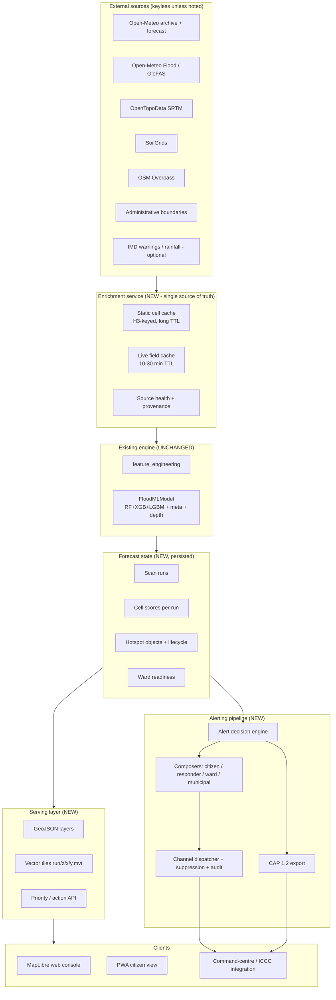

# 05 — Integration Architecture

## 1. Principles that govern every decision here

1. **Do not rewrite the engine.** The ML model, feature engineering and data collector stay (see `02 §7`). New work wraps them.
2. **One feature-assembly path.** Cells, wards, single points and nowcasts all obtain covariates from the *same* enrichment service, so no code path can invent its own inputs. This is the architectural answer to audit finding B-1.
3. **Identity is a property of the world.** H3 index for cells, stable ids for wards, immutable run ids for forecast states.
4. **Compute once, serve many.** Expensive work happens in a scan/precompute job and is persisted; requests read persisted state.
5. **Decision, composition and delivery are separate stages.** A hazard produces an `Alert`; a composer renders it; a dispatcher sends it. Nothing sends directly from a route handler.
6. **Provenance is a first-class output.** Every hazard value can name its source and its age.
7. **Everything degrades loudly.** A missing upstream source marks the response; it never fabricates a value.
8. **Interfaces over vendors.** Weather, river, terrain, basemap, translation, messaging and LLM all sit behind small interfaces with plain default implementations.

---

## 2. Target architecture



### 2.1 Runtime processes
| Process | Responsibility | Notes |
|---|---|---|
| `web` (uvicorn) | HTTP API, read-mostly, non-blocking | Replaces the current single-process design |
| `scheduler` | Owns cron only: scan refresh, nightly retrain, digest, retention purge | **Exactly one instance** — fixes audit X-5 |
| `worker` | Queue consumer: scans, alert dispatch, retraining | Keeps blocking I/O and heavy compute off the web path |
| database | Postgres + PostGIS in production, SQLite for local dev | Geospatial features require Postgres; documented fallback otherwise |

For the hackathon window the three processes MAY run inside one container as separate asyncio tasks **only if** documented, and scheduler ownership is still enforced with a lock/leader check. The default recommendation remains separate entry points.

---

## 3. Module map — what changes, what is added

| Path | Status | Responsibility |
|---|---|---|
| `services/enrichment.py` | **NEW** | The single feature-assembly path: H3 lookup, static cache, live cache, provenance, source health. Replaces all in-request synthesis. |
| `services/spatial.py` | **NEW** | H3 helpers (cell from point, k-ring, parent/child), grid generation, bbox handling, geometry simplification. |
| `services/scanner.py` | **NEW** | Scan execution: enumerate cells, enrich, batch-infer, threshold, cluster, lifecycle, persist the run. |
| `services/hotspots.py` | **NEW** | Clustering by H3 contiguity, severity classification, hotspot-object assembly. |
| `services/wards.py` | **NEW** | Boundary ingest, H3 agglomeration fallback, point-in-polygon joins, readiness computation. |
| `services/tiles.py` | **NEW** | MVT encoding per run/layer, tile caching, ETag handling. |
| `services/alerts.py` | **NEW** | `Alert` domain object, decision rules, suppression, escalation, acknowledgement. |
| `services/channels/` | **NEW** | `base.py` interface plus `email.py`, `webhook.py`, `sms.py`, `whatsapp.py`. |
| `services/compose.py` | **NEW** | Audience and language composition, CAP 1.2 rendering, deterministic fallbacks. |
| `services/actions.py` | **NEW** | Priority scoring with exposed weights; shelter/reachability hooks. |
| `services/email_service.py` | **REPLACE** | Becomes a thin transport adapter behind `channels/email.py`; template builders move to `compose.py`. |
| `services/predictor.py` | **MODIFY** | `_build_grid_requests` synthesis removed; scan/ward logic delegated to new services. Public method signatures preserved. |
| `services/data_collector.py` | **MODIFY** | Gains retries, provenance stamps, source-health writes and idempotent persistence; fetchers themselves unchanged. |
| `services/trainer.py` | **MODIFY** | Adds the metrics block (REQ-QLT-02), verified artefact save, and reports persisted hotspot counts instead of estimating. |
| `models/schemas.py` | **MODIFY** | New request/response models; `PredictionRequest` splits into *explicit* and *rich* variants so enrichment is unambiguous. |
| `database/models.py`, `database/migrations/` | **MODIFY/NEW** | New tables (§5) plus Alembic migrations. |
| `api/` routers | **NEW** | Versioned routers (`/v1/...`) split by domain; `main.py` becomes composition plus lifespan only. |
| `frontend/` | **NEW** | MapLibre console plus PWA citizen view. |
| `tests/` | **NEW** | Unit, integration and contract tests. |

---

## 4. The four focus workstreams, in detail

### 4.1 Hotspot scanning — before and after

**Today** (`services/predictor.py:267–309`): the grid is enumerated correctly, then every covariate for every cell is produced by `sin`/`cos` arithmetic on the cell's own coordinates; the result is filtered by `min_risk` and returned as a flat list with a formatted-lat/lon string as the id. Nothing is persisted.

**Target pipeline:**
```
1. Resolve area            → city id + bbox + H3 resolution (8 default, 9 micro)
2. Enumerate cells         → h3.grid_disk / polygon fill, capped by CELL_BUDGET
3. Static lookup           → DB read of cached static features per cell
                             (miss → fetch from collector → persist → continue)
4. Live attach             → one weather call per area + one discharge call,
                             applied to all cells with per-cell adjustments
5. Assemble                → PredictionRequest per cell via enrichment service
6. Batch inference         → model.predict(frame) in chunks of ~500
7. Threshold + classify    → probability, depth, severity band
8. Cluster                 → contiguous qualifying cells into hotspot objects
9. Lifecycle               → compare to previous run for the city
10. Persist                → run + cells + objects (single transaction per run)
11. Publish                → invalidate tiles for the run; enqueue alert evaluation
```

**Key design decisions embedded here:**
- **Weather is fetched once per area, not once per cell.** Cells differ because of terrain, drainage and soil — which are the *static* layers — not because of a synthetic rainfall field. This is both faster and more honest, and it is exactly what makes AC-01 pass.
- **Sub-cell rainfall variation may be added later** from a real gridded source (radar/IMD), and the enrichment interface already allows a per-cell override when one exists.
- **Clustering is contiguity-based** over H3 neighbours, so a hotspot is a place with a shape, not a list.
- **Lifecycle is computed against the previous run for the same city and resolution**, which requires run persistence (F-25) and is what makes suppression honest.

**Degradation:** if live weather is unavailable, the scan still runs but every cell is marked `weather_stale` with the timestamp of the last good value — and, per REQ-ING-02, the API returns an error rather than inventing rainfall when *no* live value exists at all.

### 4.2 Wards
```
1. Resolve city           → boundary source attempt (vendored admin dataset → municipal file → OSM admin relation)
2. Persist geometry       → wards table (id, name, provenance, geom, area, bbox, population)
3. Fallback (if none)     → H3 res-8 agglomeration: k-ring growth from the city centre,
                            adjacent cells merged, cluster centroid = ward centre,
                            provenance = 'h3_agglomerated', name = 'Zone N (H3)'
4. Readiness              → for each ward:
                              a. read the cells whose centroid falls in the polygon (ST_Contains)
                              b. area-weighted mean of probability and depth
                              c. component scores from real inputs
                              d. hotspot join: count, worst severity, depth stats
                              e. grade A–F from the composite score
5. Persist + publish      → wards/readiness/{run_id} and the ward GeoJSON layer
```

**Design notes.**
- **`ST_Contains` over cells is the whole trick.** Ward aggregation becomes a single spatial query, and the result is area-weighted rather than sample-based, which is what makes REQ-WRD-06 defensible.
- **The fallback is geometry, not fiction.** An H3-agglomerated ward is a real polygon on the ground; only its *name* is synthetic, and that is labelled in `provenance` and in the UI. This is the deliberate answer to audit A-2/A-3: the system may not have municipal boundaries, but it will never again invent a ward.
- **Component scores keep the existing semantics** (inundation, drainage/exposure stress, infrastructure exposure) so the A–F vocabulary in `models/schemas.py:139–145` survives untouched.
- **Ward ids derive from the boundary set** (hash of source + source ward code, or hash of the sorted member cell ids for agglomerated wards), which satisfies REQ-WRD-04's stability requirement.

### 4.3 Map and tile serving
```
Request: /v1/layers/{layer}?bbox=...&run_id=...        → GeoJSON (small, filtered)
Request: /v1/tiles/{layer}/{run_id}/{z}/{x}/{y}.mvt    → vector tile (city scale)
Request: /v1/runs/{run_id}                             → run metadata + layer list + legend
```
- **Both endpoints read persisted run state**; neither triggers computation. A request for a run that does not exist returns a structured `run_not_found` with the id of the most recent run, which makes client bugs obvious.
- **Tiles are the city-scale path** because a 2,500-cell JSON payload is unusable on mobile, while a viewport of MVT tiles is tens of kilobytes.
- **Properties are quantised** (probability to 2 decimals, depth to centimetres, severity as an integer band) to keep tiles small and stable.
- **Cache headers are run-scoped:** a run is immutable, so its tiles may be cached aggressively (`Cache-Control: public, max-age=...`, plus a strong `ETag` on the run id). This is the opposite of the current no-cache default and directly satisfies REQ-MAP-04.
- **Basemap is a configuration value**, defaulting to a self-hosted style with no key, with attribution rendered in the client.

### 4.4 The alert pipeline — decide, compose, deliver
```
        ┌──────────────────────────────────────────────────────────┐
        │ 1. DECIDE  (services/alerts.py, runs after every scan)   │
        │    for each hotspot/ward crossing a band:                 │
        │      severity band · urgency · certainty                  │
        │      area (H3 cells + ward polygon) · validity window     │
        │      instruction per audience · reason (top drivers)      │
        │      suppression check against alert history              │
        │    → Alert object persisted (status = created/suppressed) │
        └───────────────────────────┬──────────────────────────────┘
                                    │ (queued, never inline)
        ┌───────────────────────────▼──────────────────────────────┐
        │ 2. COMPOSE  (services/compose.py)                        │
        │    audience: citizen · responder · ward officer · municipal│
        │    language: requested → translation service → fallback    │
        │    renders: email HTML + text, SMS (160 chars),           │
        │             WhatsApp template, JSON webhook, CAP 1.2 XML   │
        └───────────────────────────┬──────────────────────────────┘
                                    │
        ┌───────────────────────────▼──────────────────────────────┐
        │ 3. DELIVER  (services/channels/*)                        │
        │    targets from subscriptions / contact groups only       │
        │    per-attempt record · retry with backoff · dead-letter   │
        │    acknowledgement endpoint · escalation on timeout        │
        └──────────────────────────────────────────────────────────┘
```
**The four rules that make this architecture correct:**
1. **No route handler sends anything.** Dispatch is a queued job (REQ-ALT-10, AC-13).
2. **Recipients are never request-supplied by an unauthenticated caller** (REQ-ALT-05, AC-09) — this is the fix for the open-relay finding D-1.
3. **The same verified numbers feed every audience** — the LLM/translation layer may reword, never recompute (dossier §9).
4. **CAP is a rendering, not a feature** — because the internal object is already CAP-shaped, export is a pure function (REQ-ALT-03, AC-11).

---

## 5. Data model

New and changed tables. Keys are chosen so that identity is stable and joins are single-statement.

| Table | Key / important columns | Purpose |
|---|---|---|
| `cell_static` | `h3` (PK), `resolution`, elevation, slope, curvature, flow_accum, stream_dist, water_dist, soil_type, clay_pct, impervious_pct, drainage_prox, pump_count, building_density, fetched_at, source | The cached static layer (F-02). One row per cell, reused forever. |
| `cell_live` | `h3`, `observed_at` (composite PK), rainfall series, soil_moisture, temperature, humidity, wind, pressure, discharge, discharge_anomaly, source | Short-TTL live snapshot (F-03). |
| `scan_run` | `run_id` (PK), city_id, resolution, params_json, input_hash, model_version, started_at, finished_at, status, cells_scanned, cell_budget | Immutable forecast state (F-25). |
| `cell_score` | `run_id` + `h3` (composite PK), probability, depth_m, severity, drivers_json, lifecycle, prev_run_id | Per-cell results of a run. |
| `hotspot` | `hotspot_id` (PK), `run_id`, city_id, centroid, geom (polygon), cell_count, area_km2, max_probability, mean_probability, max_depth_m, severity, dominant_driver, lifecycle, first_seen, last_seen | Hotspot objects (F-22/F-23). |
| `ward` | `ward_id` (PK), city_id, name, provenance, geom (polygon), area_km2, bbox, population, source | Real or agglomerated ward geometry (F-10/F-11). |
| `ward_readiness` | `run_id` + `ward_id` (composite PK), grade, risk_score, component scores, hotspot_count, worst_severity, depth stats, actions_json, resources_json | Ward scores per run (F-13/F-15). |
| `facility` | `facility_id` (PK), city_id, type (hospital/school/shelter/elderly/pump/fire), name, geom (point), capacity, status, source | Exposure and response targets (F-36). |
| `alert` | `alert_id` (PK), created_at, hazard, severity, urgency, certainty, audience, ward_id, hotspot_id, geom, valid_from, valid_to, instruction, reason_json, source_run_id, status (created/suppressed/escalated/closed), suppression_key | The alert domain object (F-40). |
| `alert_delivery` | `delivery_id` (PK), alert_id, channel, recipient_ref (hashed), attempt, provider_ref, status, error, sent_at, acked_at | Delivery audit and acknowledgement (F-46/F-47). |
| `subscription` | `sub_id` (PK), contact_ref (hashed), channel, h3_cells[] or ward_ids[], language, audience, created_at, consent_at, purpose, revoked_at | Citizen/agency subscriptions with consent (F-50, DPDP). |
| `consent_record` | `consent_id` (PK), contact_ref, purpose, granted_at, withdrawn_at, evidence | Consent evidence (dossier §8.1). |
| `source_health` | `source` (PK), last_success_at, last_error, last_error_at, consecutive_failures | Freshness and trust signal (F-77). |
| `observation` | existing | Unchanged. |
| `flood_event` | existing — **must actually be created** (`database/db.py:38–42` currently omits it) | Verified events for validation. |

### 5.1 Referential and lifecycle rules
- `cell_score`, `hotspot`, `ward_readiness` are **immutable per run**; a correction creates a new run rather than mutating history. This gives free audit, replay (F-28) and honest trend curves.
- `alert.suppression_key` = `hash(area_id + severity + hazard)`; a partial unique index on `(suppression_key)` with a validity window implements suppression in the database rather than in application logic (REQ-ALT-06).
- `alert_delivery.recipient_ref` stores a hash, not the address, so the delivery table is not itself a personal-data store (NFR-PRV-02) while still supporting per-recipient idempotency.
- `cell_static` and `ward` are keyed by stable ids, so re-running a scan is an upsert and never a duplicate.

---

## 6. Spatial model

### 6.1 Resolution policy
| Product tier | H3 res | Avg area | Avg edge | Use |
|---|---|---|---|---|
| City zoning | 7 | 5.16 km² | 1.41 km | coarse overview, ward roll-ups |
| **Default product cell** | **8** | **0.74 km²** | **0.53 km** | maps, alerts, ward aggregation |
| Micro-hotspot mode | 9 | 0.105 km² | 0.20 km | street-level drill-down, drainage-scale analysis |

The two resolutions are hierarchically related (~7 res-9 cells per res-8 cell), so a view may be computed at res 9 and rolled up to res 8 *without geometry operations*. That is the mechanism that lets the product claim both "1 km" and "250 m" capability honestly, and it is what the current implementation cannot do.

### 6.2 Core spatial operations and their implementation
| Operation | Implementation | Replaces |
|---|---|---|
| Point → cell | `h3.latlng_to_cell(lat, lon, res)` | formatted lat/lon string ids |
| Cell → neighbours (clustering) | `h3.grid_disk` / `h3.grid_ring` | none (new) |
| Cell → parent/child (roll-up) | `h3.cell_to_parent` / `cell_to_children` | none (new) |
| Area → cells | polygon fill or `grid_disk` around centre, capped by budget | `_build_grid_requests` loop |
| Cell → ward | `ST_Contains(ward.geom, cell_centroid)` | none (new) |
| Hotspot → ward | `ST_Intersects(ward.geom, hotspot.geom)` | none (new) |
| Bbox → features | `ST_MakeEnvelope` + GiST index | `between(lat ± 0.1)` |

### 6.3 Why hexagons for alerts specifically
A CAP `area` element wants a polygon. A hexagon is a polygon, so a cell-aligned alert area is *directly* expressible; a lat/lon bounding box is not, and a "ward name" is not. Using H3 from the start means the alert geometry, the map layer and the suppression key are all the same object — which is precisely the kind of coherence that makes an architecture look designed rather than assembled.

---

## 7. Degradation matrix

Every dependency can fail; the architecture must state what happens. This table is the operational contract.

| Failure | Detection | Behaviour | User-visible effect |
|---|---|---|---|
| Weather provider down | source-health threshold | Scan proceeds on last-good live values, marked `weather_stale` | Data-age badge turns amber; response carries the stale timestamp |
| No live weather ever fetched | absence of a live row | Enrichment refuses (REQ-ING-02) | Structured 503 with a retry hint — no fabricated prediction |
| Terrain provider down mid-scan | per-cell fetch error | Cells without static features are excluded and counted | Response reports `excluded_cells` with a reason |
| River discharge unavailable | source-health | Documented neutral values **plus** an explicit marker | Provenance lists the missing source |
| Database unreachable | health probe | `/ready` fails; `/health` reports the dependency down | Orchestrator stops routing traffic |
| Model artefact missing or unverifiable | load-time hash check | Service starts in read-only "last good run" mode | Responses carry `model_status: unavailable`; no new predictions |
| Email provider down | dispatch error | Retry with backoff, then dead-letter | Delivery table shows failures; the alert stays visible in-app |
| Translation service down | call failure/timeout | Deterministic fallback template in the source language | Message still sent, with a language note |
| Scheduler not running | heartbeat staleness | `/health` reports scheduler down; scans can be triggered manually | Console shows "last scan 3 h ago" |
| Tile backend error | request error | Client falls back to the GeoJSON layer for the viewport | Slightly heavier load, same information |
| PostGIS unavailable (SQLite dev) | capability probe | Spatial joins fall back to a Python point-in-polygon path; ward GeoJSON still served | Dev-only; a log line warns |

**Design rule:** a degradation may reduce *coverage* or *freshness*, but never *honesty*. There is no path in this architecture where a value is fabricated and left unmarked.

---

## 8. Migration path — strangler, not big bang

The programme deliberately avoids a rewrite. Every step leaves the system runnable, and every step is independently demonstrable.

| Step | Change | Old behaviour retained | New capability |
|---|---|---|---|
| M0 | Freeze the current interface; add `/v1` aliases delegating to existing handlers | Everything | Versioning without breakage |
| M1 | Introduce `services/enrichment.py`; route `/predict` through it | Existing endpoints unchanged | Real covariates for single-point predictions (F-01) |
| M2 | Introduce H3 helpers and run persistence; add `/v1/scan` alongside `/hotspots` | `/hotspots` keeps its old shape | Real scans, stable ids, persisted runs |
| M3 | Introduce the wards service; add `/v1/wards` and `/v1/wards/readiness` | `/wards/readiness` keeps its old shape | Real or labelled-agglomerated wards with geometry |
| M4 | Introduce layer and tile endpoints plus the MapLibre console | API-only access still works | The visual product |
| M5 | Introduce the alert pipeline; convert `/email/*` into deprecated thin wrappers that create an `Alert` and enqueue it | Old paths still function, now authenticated and allowlisted | Decision/compose/deliver separation, CAP, audit, suppression |
| M6 | Retire the synthetic generators once M2/M3 are verified by AC-01/AC-05 | — | Audit findings structurally closed, not merely bypassed |

**Why this order:** it front-loads the fixes that protect credibility (M1–M3), then the fix that wins UX marks (M4), then the fix that removes a security liability (M5), and only then deletes the old code (M6) — after the acceptance criteria prove the replacement is better.

---

## 9. Configuration surface

All tunables in one place, all overridable by environment, all with safe defaults so the system starts with an empty environment (REQ-NFR-PRT-02).

| Setting | Default | Purpose |
|---|---|---|
| `CELL_RESOLUTION` | `8` | Default product resolution |
| `MICRO_RESOLUTION` | `9` | Drill-down resolution |
| `MAX_CELLS_PER_SCAN` | `6000` | Cell budget (REQ-SCN-06) |
| `SCAN_INTERVAL_MINUTES` | `15` | Scheduler cadence |
| `STATIC_CACHE_TTL_DAYS` | `180` | Static feature cache |
| `LIVE_CACHE_TTL_MINUTES` | `15` | Live field cache |
| `BOUNDARY_SOURCE` | `auto` | `auto` / `vendored` / `municipal` / `h3` |
| `ALERT_THRESHOLDS_JSON` | policy defaults from `03 §5.3` | Band triggers |
| `SUPPRESSION_WINDOWS_JSON` | per band | Anti-duplicate policy |
| `ALERT_CHANNELS` | `email` | `email`, `webhook`, `sms`, `whatsapp` |
| `ALERT_CONTACT_GROUPS` | empty | Allowlisted dispatch targets |
| `BASEMAP_STYLE_URL` | self-hosted, keyless | Map style (REQ-MAP-11) |
| `TRANSLATION_PROVIDER` | `none` | `none` / `bhashini` / `llm` |
| `ENRICHMENT_STRICT` | `true` | Fail rather than default (REQ-ING-02) |
| `PUBLIC_TIER_ENABLED` | `false` | Anonymous coarse read access |

---

## 10. Architectural risks and the mitigations already designed in

| Risk | Why it matters | Mitigation in this design |
|---|---|---|
| Upstream rate limits during a city scan | A run could be throttled mid-scan and produce a partial view | The static cache makes repeats cheap, live attach is one call per area, and per-source health gates retries |
| H3 unfamiliarity | Team-velocity risk inside a six-day window | H3 is one pure-Python dependency with a small API; the operations needed are five functions (§6.2) |
| PostGIS operational overhead | New infrastructure to run and back up | Required only in production; a SQLite fallback path is documented; migrations are additive |
| First-render tile cost | The first view after a run could be slow | Tiles are generated lazily per tile and cached per immutable run; the console pre-warms the current viewport |
| Alert-policy tuning during the demo | Wrong thresholds make a demo either empty or noisy | Thresholds are configuration and the demo uses a rehearsed scenario with a known outcome (`08` demo script) |
| Scope growth | The four focus areas are already substantial | Non-goals are explicit (`03 §5.5`) and the six-day plan marks a hard scope-cut line |


